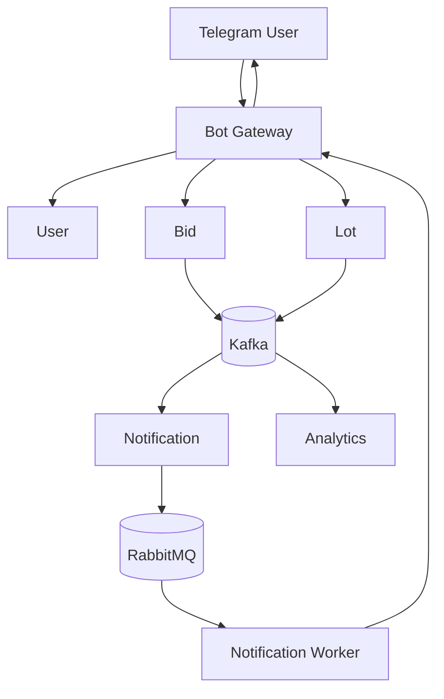

# TradeHub (Telegram Edition)

TradeHub — это микросервисная аукционная платформа с управлением через **Telegram-бота**.
Проект демонстрирует:

* Реальные торги и ставки в реальном времени
* Event-driven архитектуру (Kafka, RabbitMQ)
* Кэширование и стриминг (Redis, gRPC)
* Контейнеризацию (Docker)
* Мониторинг и метрики (Prometheus + Grafana)

## Архитектура

### Микросервисы

#### 1. Bot Gateway (Telegram Bot Service)

* Точка входа для пользователей.
* Работает через Telegram Bot API (webhook).
* Авторизация через `telegram_id`.
* Проксирует команды в другие сервисы.
* Получает события от Notification Service и отправляет их пользователям.

#### 2. User Service

* Управление пользователями.
* **Основной идентификатор** — `telegram_id`.

**БД (PostgreSQL):**

* `users(id, telegram_id, username, created_at)`

**Ручки (REST):**

* `POST /users/register`
* `GET /users/{telegram_id}`

#### 3. Lot Service

* Управление лотами (создание, просмотр, завершение).
* Кэширование активных аукционов в Redis.

**БД (PostgreSQL):**

* `lots(id, title, description, start_price, current_price, status, owner_id, created_at)`

**Ручки (REST):**

* `POST /lots` — создать лот
* `GET /lots` — список лотов
* `GET /lots/{id}` — инфо о лоте
* `PATCH /lots/{id}/finish` — завершить аукцион

#### 4. Bid Service

* Обработка ставок в реальном времени.
* Обновляет цену в Redis.
* Отправляет события в Kafka.

**БД (PostgreSQL):**

* `bids(id, lot_id, user_id, amount, created_at)`

**gRPC API:**

* `PlaceBid(lot_id, user_id, amount)`
* `StreamBids(lot_id)`

#### 5. Notification Service

* Отвечает за доставку уведомлений пользователям (через Telegram).
* Подписан на Kafka (`bid.placed`, `lot.sold`).
* Каждое событие из Kafka формирует **задачу в RabbitMQ**.
* Workers читают задачи из RabbitMQ и доставляют их в Bot Gateway.
* Если Telegram API недоступен — сообщение остаётся в очереди до повторной попытки.

**Примеры задач в RabbitMQ:**

* `send_telegram_message(user_id, text)`
* `notify_lot_finished(lot_id, winner_id)`
* `notify_outbid(user_id, lot_id)`

#### 6. Analytics Service

* Сбор статистики и событий (Kafka).
* Хранение в ClickHouse / TimescaleDB.
* Метрики: популярность лотов, активность пользователей.
* Визуализация: Prometheus + Grafana.

## Связи между сервисами

## Поток данных (пример)

1. Пользователь пишет `/create_lot` в Telegram.
2. **Bot Gateway** вызывает API **Lot Service**.
3. Пользователь получает ответ "Лот создан".
4. Другой юзер пишет `/bid 123 1000`.
5. **Bot Gateway** вызывает **Bid Service**.
6. Bid Service сохраняет ставку, обновляет Redis, шлет событие в Kafka.
7. **Notification Service** ловит событие и кладёт задачу в RabbitMQ.
8. Worker достаёт задачу из RabbitMQ → отправляет уведомление в Bot Gateway.
9. Пользователь получает сообщение в Telegram.

## Telegram команды

### Общие

* `/start` — приветствие и регистрация
* `/help` — список доступных команд
* `/profile` — профиль пользователя

### Работа с лотами

* `/create_lot` — создать новый лот (бот запросит название, описание, стартовую цену)
* `/lots` — список активных лотов
* `/lot {id}` — информация о конкретном лоте
* `/my_lots` — список моих лотов
* `/end_lot {id}` — завершить свой лот

### Ставки

* `/bid {lot_id} {amount}` — сделать ставку
* `/my_bids` — список моих ставок
* `/watch {lot_id}` — подписаться на обновления по лоту

### Уведомления (автоматически приходят)

* Новая ставка на ваш лот
* Ваша ставка перебита
* Ваш лот завершен
* Вы выиграли аукцион 🎉

## Инфраструктура

* Контейнеризация: Docker
* Event Streaming: Kafka (реальные события аукциона)
* Очереди задач: RabbitMQ (уведомления, фоновые задачи)
* Кэш: Redis (активные лоты и текущие цены)
* Базы данных: PostgreSQL (основные данные), ClickHouse (аналитика)
* Мониторинг: Prometheus + Grafana
* Логи: Zap

## Roadmap

* [ ] Авторизация и хранение пользователей через Telegram ID
* [ ] Создание и управление лотами
* [ ] gRPC для ставок
* [ ] Kafka-события и интеграция с RabbitMQ
* [ ] Telegram-уведомления о новых ставках и победах
* [ ] Аналитика + дашборды Grafana
* [ ] Тесты (unit + integration)